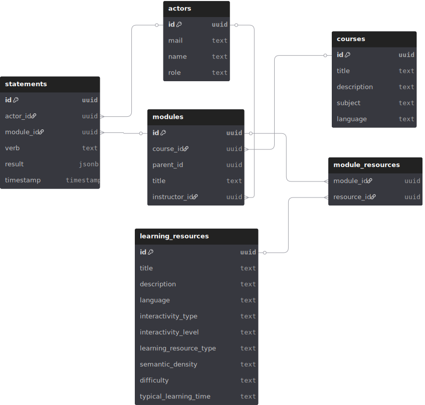

# Database
**Database**

This directory includes synthetic learner data, data generators and data import scripts. For the initial setup of the Learning Record Store (LRS), a dump file containing seed data is provided.
You can set up the LRS using either Docker or manual installation.

## Table of Contents

- [Prerequisites](#prerequisites)
- [1. LRS Setup](#1-lrs-setup)
  - [1.1 Docker](#11-docker)
  - [1.2 Manual Setup](#12-manual-setup)
- [2. Synthetic Data Generation](#2-synthetic-data-generation)
  - [2.1 Course Structure Generator](#21-course-structure-generator)
  - [2.2 xAPI Generator](#22-xapi-generator)
  - [2.3 Insert Generated Data into LRS](#23-insert-generated-data-into-lrs)
- [3. Further Resources](#3-further-resources)
  - [3.1 Database Schema](#31-database-schema)

---

## Prerequisites

Tested with the following environment:
- **Ubuntu 24.04.2 LTS**
- **PostgreSQL 16.9**
- **Python 3.12.3+** (if using generation & migration scripts)

For manual setup of the LRS, ensure you have a running PostgreSQL instance and an empty database ready to import the initial data. Refer to the [PostgreSQL documentation](https://www.postgresql.org/docs/) for setup guidance. Once your database is ready, import the seed data as described in [Section 1.2](#12-manual-setup).

---

## 1. LRS Setup

### 1.1 **Docker**:
   The database setup can be automated using Docker. Follow the steps below to set up the PostgreSQL database.

   1. **Make the script executable**:
      ```bash
      chmod +x PATH/TO/REPO/database/setup_postgres.sh
      ```

   2. **Run the script**:
      ```bash
      PATH/TO/REPO/database/setup_postgres.sh
      ```
Afterwards, the PostgreSQL database is exposed at the default port `5432`

### 1.2 **Manual Setup**:
   Manually import the initial batch of synthetic data. This process will create the required schemas and tables and insert the synthetic data into the corresponding tables.

   ```bash
   psql -U <YOUR_DB_USER> -d <YOUR_DB_NAME> -f dumpfile.sql
   ```

---

## 2. Synthetic Data Generation

### 2.1 Course Structure Generator

The [`Courses`](https://github.com/amt-pj-ss25-e-learning-visualization/amt-pj-ss25-dashboard/tree/main/database/synthetic_data/data_generation/course) module enables the generation of synthetic course manifests and corresponding learning resources by querying the [ESCO database](https://esco.ec.europa.eu/en/classification/occupation_main) for a specified occupation.

1. **Change working directory**:
   ```bash
   cd PATH/TO/REPO/database/synthetic_data_data_generation
   ```

2. **Run the python module**:
   ```bash
   python -m course.main <ESCO_CONCEPT_URI> <COURSE_SUBJECT> (optional: -o <OUTPUT_DIR>)
   ```

---

### 2.2 xAPI Generator

The [`xAPI`](https://github.com/amt-pj-ss25-e-learning-visualization/amt-pj-ss25-dashboard/tree/main/database/synthetic_data/data_generation/xAPI) module generates synthetic xAPI statements in JSON format, based on the course data produced in [Section 2.1](#21-course-structure-generator).

1. **Setup Module Config**:
   Set the paths for `COURSE_STRUCTURE_MANIFEST_PATH` & `OUTPUT_FILE_PATH`.
   ```bash
   nano PATH/TO/REPO/database/synthetic_data/data_generation/xAPI/config.py
   ```

2. **Run the python module**:
   ```bash
   python -m xAPI.main
   ```

---

### 2.3 Insert Generated Data into LRS

The [`learning_record_store`](https://github.com/amt-pj-ss25-e-learning-visualization/amt-pj-ss25-dashboard/tree/main/database/synthetic_data/learning_record_store) module imports the generated course data and xAPI statements into the existing LRS.

1. **Setup Module Config**:
   Set the paths for `IMS_MANIFEST`, `XAPI_STATEMENTS_JSON`, and DB credentials for `DB_CONFIG`.
   ```bash
   nano PATH/TO/REPO/database/synthetic_data/learning_record_store/xAPI/config.py
   ```

2. **Run the python module**:
   ```bash
   python -m learning_record_store.main (optional: --truncate, removes previous data from tables)
   ```

---

## 3. Further Resources

### 3.1 Database Schema


